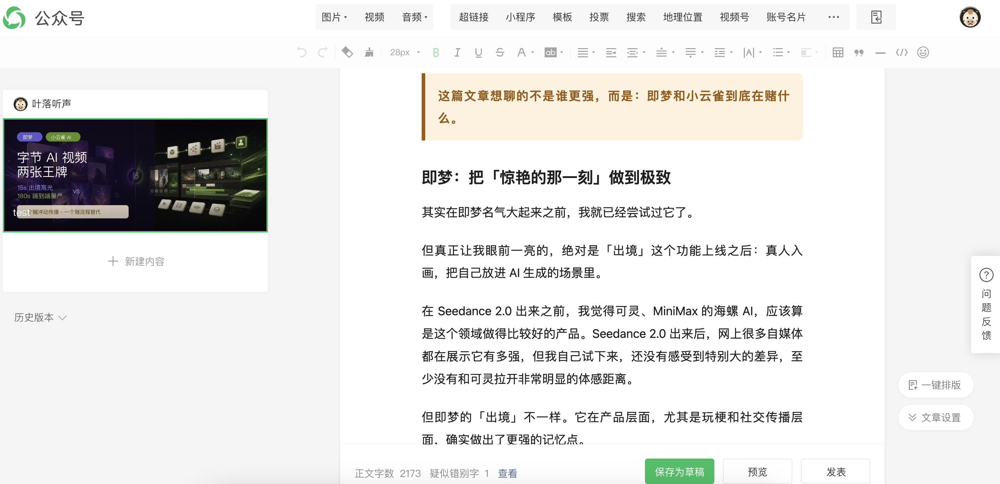
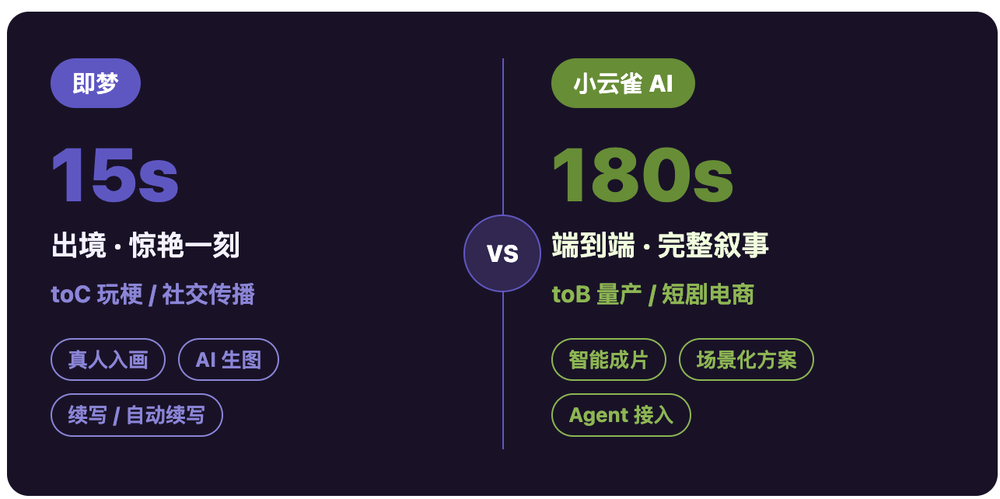

# wechat-writer

把 Markdown 文章变成适合微信公众号粘贴的精美 HTML。

`wechat-writer` 是一个 Codex Skill：你给它一篇普通 Markdown，它会先把文章升级成「增强 Markdown」，再渲染成带复制按钮的公众号 HTML。复制后直接粘贴到微信公众号编辑器里，标题、正文、对比卡片、重点提示、时间轴等样式会一起带过去。

它不是又一个普通 Markdown 转 HTML 工具。它更像一个懂公众号排版的文章设计助手。

## 为什么值得试试

- **一键复制到公众号**：生成的 HTML 自带复制按钮，只复制正文区域，不复制预览页工具栏。
- **保留 Markdown 通用性**：标准 Markdown 交给 `markdown-it-py` 解析，支持标题、列表、嵌套列表、引用、图片、表格、代码块、删除线等常见语法。
- **更像公众号文章，而不是网页**：所有关键样式都转成 inline style，尽量适配微信公众号编辑器的粘贴行为。
- **支持增强模块**：普通 Markdown 不够表达设计意图时，可以用 `:::hero-compare`、`:::callout`、`:::compare-cards`、`:::timeline`、`:::placeholder` 做出更像深度分析文章的视觉模块。
- **AI 先规划，脚本再稳定渲染**：让 AI 判断哪里该变成 hero、callout、对比卡片，最终渲染交给脚本，兼顾美观和可复用。

## 效果预览

> TODO: 在这里补一张顶部 hero + 正文整体效果截图。

<!--

-->

> TODO: 在这里补一张复制到公众号后的编辑器截图。

<!--

-->

> TODO: 在这里补一张增强模块细节图，例如 VS hero、时间轴、对比卡片。

<!--

-->

## 适合什么文章

特别适合这些类型：

- AI 工具测评
- 产品对比
- 行业观察
- 深度复盘
- 教程/工作流文章
- 带大量观点、风险提醒、对比结论的公众号长文

如果你的文章只是几段普通短文，它也能转；但真正好看的地方，是把文章结构抽成模块后呈现出来。

## 安装

把这个仓库放到你的 Codex skills 目录：

```bash
git clone git@github.com:cc17/wechat-writer.git ~/.codex/skills/wechat-writer
```

安装 Python 依赖：

```bash
python3 -m pip install -r ~/.codex/skills/wechat-writer/requirements.txt
```

> 没装依赖也能跑基础转换，但推荐安装。标准 Markdown 的完整解析依赖 `markdown-it-py` 和 `beautifulsoup4`。

## 快速使用

在 Codex 里直接说：

```text
$wechat-writer 帮我把 article.md 优化成公众号 HTML
```

它会倾向于产出：

- `article.enhanced.md`：AI 规划后的增强 Markdown
- `article.wechat.html`：可打开预览、可一键复制到公众号的 HTML
- `article.intro.md`：公众号简介和备选标题，如果你需要

你也可以直接运行脚本：

```bash
python3 ~/.codex/skills/wechat-writer/scripts/md_to_wechat_html.py article.enhanced.md -o article.wechat.html
```

然后在浏览器里打开 `article.wechat.html`，点击「复制到公众号」，去微信公众号编辑器粘贴。

## 增强 Markdown 示例

普通 Markdown 负责内容，增强模块负责设计意图。

### 顶部 VS Hero

```markdown
:::hero-compare
left_label: 即梦
left_value: 15s
left_title: 出境 · 惊艳一刻
left_subtitle: toC 玩梗 / 社交传播
left_tags: 真人入画, AI 生图, 续写
right_label: 小云雀 AI
right_value: 180s
right_title: 端到端 · 完整叙事
right_subtitle: toB 量产 / 短剧电商
right_tags: 智能成片, 数字人, Agent 接入
:::
```

### 重点提示

```markdown
:::callout warning
「一次生成、结果不可控」，才是 toB 落地最大的风险敞口。
:::
```

可选类型：

- `primary`：创意、toC、用户体验
- `secondary`：生产力、toB、机会点
- `warning`：成本、风险、现实提醒

### 双栏对比卡

```markdown
:::compare-cards
即梦 | 核心功能: 出境 · AI 生图 · 续写 | 单次时长: 15 秒 | 目标用户: toC 创作者
小云雀 AI | 核心功能: 端到端 Agent · 场景模板 | 单次时长: 最长 180 秒 | 目标用户: toB 内容团队
:::
```

### 时间轴/进度条

```markdown
:::timeline
即梦出境 | 15s | 单点高光，适合制造第一眼冲击 | primary
即梦续写 | 60s | 多段接力延长，但仍像拼接 | primary
小云雀最长 | 180s | 有机会完成开场、铺垫、高潮和收尾 | secondary
:::
```

### 截图占位

```markdown
:::placeholder
title: 产品效果截图
hint: 建议放 1-2 张个人实测截图
:::
```

## 设计风格

默认风格偏「深度分析型公众号文章」：

- 白底长文，正文克制
- 深色顶部对比 hero
- 紫色代表创意/toC/体验
- 绿色代表生产力/toB/机会
- 琥珀色代表成本/风险/现实提醒
- 对比卡、时间轴、截图占位承担视觉节奏

详细风格说明见 [`references/style-guide.md`](references/style-guide.md)。

## 仓库结构

```text
wechat-writer/
├── SKILL.md
├── README.md
├── requirements.txt
├── agents/
│   └── openai.yaml
├── assets/
│   └── default-theme.json
├── references/
│   └── style-guide.md
└── scripts/
    └── md_to_wechat_html.py
```

## Roadmap

- [ ] 补充真实效果截图
- [ ] 增加更多增强模块，例如数据指标卡、步骤卡、FAQ
- [ ] 增加移动端预览测试样例
- [ ] 增加一组文章模板示例
- [ ] 支持更多主题色配置

## Star / Fork

如果你也经常写公众号，或者想让 AI 生成的文章不再像「裸 Markdown」，欢迎 fork 改成自己的风格。

如果这个 skill 对你有用，也欢迎点个 star。后续我会继续把更多公众号常用版式抽成可复用模块。
